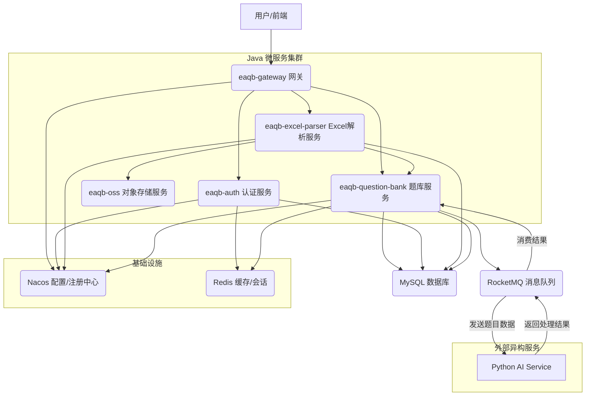

# ExcelAIQ-Bank 项目部署手册与技术架构（由Manus完成编写）

## 1. 项目简介

**ExcelAIQ-Bank** 是一个基于 **Spring Cloud Alibaba** 微服务架构的智能题库系统。其核心功能是允许用户通过上传标准格式的 Excel 文件，系统自动解析文件内容，并将题目数据导入题库。系统设计上预留了与外部 AI 服务的集成接口，用于实现题目的智能处理（例如自动生成解析、校验答案等）。

## 2. 技术架构

### 2.1. 架构图

本系统采用微服务架构，各模块通过 Spring Cloud 组件进行协作。特别是，为了体现微服务架构的**技术异构**特性，核心的 AI 处理服务被设计为一个独立的 **Python 服务**，通过消息队列与 Java 后端进行异步通信。



### 2.2. 技术栈与异构说明

本项目主要采用 Java 技术栈，并结合了多种主流的微服务组件。

| 模块/组件 | 核心技术 | 作用 | 异构说明 |
| :--- | :--- | :--- | :--- |
| **后端微服务** | Java 17, Spring Boot 3, Spring Cloud Alibaba | 业务逻辑实现、服务治理 | 主体架构，负责业务流程控制。 |
| **AI 处理服务** | **Python** (或其他语言) | 接收题目数据，调用 LLM/AI 模型进行处理 | **技术异构**：该服务独立于 Java 体系，通过 RocketMQ 异步解耦，允许使用最适合 AI/ML 的 Python 生态。 |
| **服务治理** | Nacos | 服务注册与发现、统一配置管理 | |
| **消息队列** | RocketMQ | 异步处理 Excel 解析后的题目数据，实现与 AI 服务的解耦。 | 确保系统的高吞吐量和高可用性。 |
| **数据库** | MySQL | 存储用户、权限、题目等核心业务数据。 | |
| **缓存** | Redis | 分布式会话管理、缓存 AI 处理结果。 | |
| **对象存储** | MinIO/阿里云 OSS | 存储用户上传的原始 Excel 文件。 | |

**关于技术异构的优势：**

将 AI 服务独立为 Python 编写的微服务，充分利用了 Python 在数据科学和机器学习领域的强大生态（如 PyTorch, TensorFlow, OpenAI SDK）。这种设计避免了在 Java 服务中集成复杂的 AI 依赖，使得各服务可以专注于自身领域，提高了系统的**灵活性**、**可维护性**和**技术选型的自由度**。

## 3. 部署指南

### 3.1. 环境准备

在部署项目前，请确保您的环境已安装以下依赖：

1.  **Java Development Kit (JDK)**: 17 或更高版本。
2.  **Apache Maven**: 3.6.3 或更高版本。
3.  **数据库**: MySQL 8.0+。
4.  **中间件**:
    *   Nacos Server (用于服务注册与配置)。
    *   RocketMQ Server (用于异步消息通信)。
    *   Redis Server (用于缓存和会话)。

### 3.2. 后端服务部署 (Java)

1.  **克隆项目**：
    ```bash
    git clone https://github.com/zshs000/ExcelAIQ-Bank.git
    cd ExcelAIQ-Bank
    ```

2.  **配置数据库**：
    *   创建 MySQL 数据库，例如 `eaqb_db`。
    *   根据项目中的 `application.yml` 或 `application-dev.yml` 配置数据库连接信息。

3.  **配置 Nacos**：
    *   启动 Nacos Server。
    *   在 Nacos 中配置各微服务的配置文件（例如 `eaqb-auth.yml`, `eaqb-question-bank.yml` 等）。

4.  **编译与打包**：
    ```bash
    mvn clean install -DskipTests
    ```

5.  **启动服务**：
    *   按照依赖关系或使用脚本依次启动各微服务模块的 JAR 包。
    *   **推荐启动顺序**：`eaqb-distributed-id-generator` -> `eaqb-auth` -> `eaqb-oss` -> `eaqb-question-bank` -> `eaqb-excel-parser` -> `eaqb-gateway`。

### 3.3. AI 服务接入 (Python)

AI 服务是独立于本仓库的 Python 应用。其主要职责是：

1.  **监听 RocketMQ**：订阅 `TOPIC_TEST`（或实际发送题目数据的 Topic）。
2.  **处理逻辑**：接收题目内容，调用 AI 模型（如 GPT-4, Claude 3.5 等）生成解析或校验答案。
3.  **发送结果**：将处理结果发送到 `AIProcessResultTopic`。

**接入步骤：**

1.  **编写 Python 服务**：使用 Python 的 RocketMQ 客户端库和 AI SDK 编写服务逻辑。
2.  **配置连接**：确保 Python 服务能正确连接到 RocketMQ Server。
3.  **启动服务**：
    ```bash
    python ai_service_main.py
    ```

一旦 Python AI 服务启动并连接到 RocketMQ，它将自动开始消费 Java 后端发送的题目处理请求，并将结果异步返回给 `eaqb-question-bank` 服务进行最终的数据库更新。
