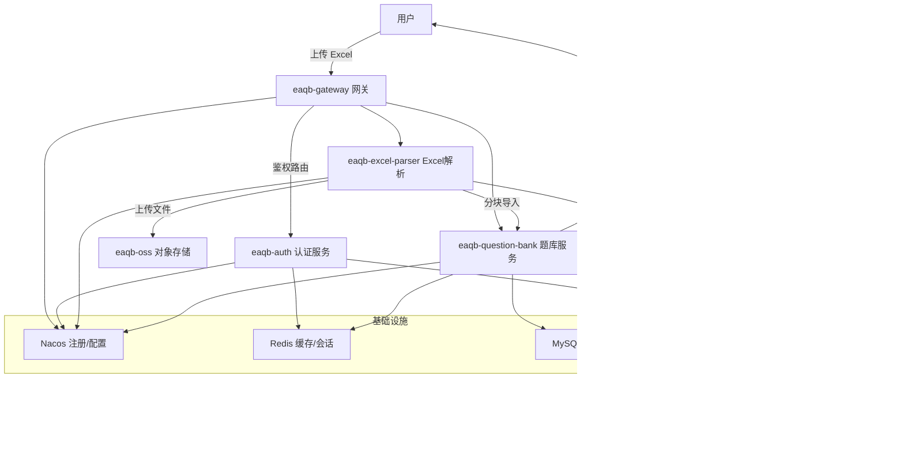

# ExcelAIQ-Bank

基于 **Spring Cloud Alibaba** 微服务架构的智能题库系统。用户上传 Excel 文件，系统自动解析并导入题目到题库，通过 RocketMQ 异步对接 AI 服务进行题目处理，最终由人工审核完成闭环。

## 技术栈

Java 17 + Spring Boot 3 + Spring Cloud Alibaba + MySQL 8.0 + Redis + Nacos + RocketMQ + MinIO/阿里云 OSS

## 系统架构

```mermaid
graph TD
    A[用户] -->|上传 Excel| B[eaqb-gateway 网关]
    B -->|鉴权路由| C[eaqb-auth 认证服务]
    B --> D[eaqb-excel-parser Excel解析]
    B --> E[eaqb-question-bank 题库服务]

    D -->|上传文件| F[eaqb-oss 对象存储]
    D -->|分块导入| E
    E -->|Outbox 模式| G[RocketMQ]
    G -->|AI 处理请求| H[AI Service]
    H -->|处理结果回包| G
    G -->|Inbox 幂等消费| E
    E -->|人工审核| A

    subgraph 基础设施
        I[Nacos 注册/配置]
        J[Redis 缓存/会话]
        K[MySQL 数据库]
        L[分布式 ID 生成器]
    end

    C --> J
    E --> J
    E --> K
    D --> K
    C --> K
    B --> I
    C --> I
    D --> I
    E --> I
```

## 模块说明

| 模块 | 职责 |
|------|------|
| `eaqb-gateway` | API 网关，统一入口、路由、Sa-Token 鉴权、IP 透传 |
| `eaqb-auth` | 认证服务，验证码登录、Token 管理、密码修改 |
| `eaqb-user` | 用户服务，用户信息 CRUD、角色权限管理 |
| `eaqb-question-bank` | 题库核心服务，题目 CRUD、AI 异步处理（Outbox/Inbox）、人工审核 |
| `eaqb-excel-parser` | Excel 解析服务，两阶段导入（校验→解析→分块推送） |
| `eaqb-oss` | 对象存储服务，文件上传/下载（MinIO/阿里云 OSS） |
| `eaqb-distributed-id-generator` | 分布式 ID 生成器（基于美团 Leaf） |
| `eaqb-framework` | 公共框架层，通用工具、上下文传递、操作日志、Jackson 配置 |

## 核心链路

### Excel 导入

上传校验 → OSS 存储 → 流式解析 → 分块推送 → 临时表暂存 → 原子提交到正式题目表

详细文档：`docs/excel-import/`

### AI 异步处理

题目发送 → Outbox 派发 → RocketMQ → AI 处理 → 回包幂等消费 → 状态推进 → 人工审核

详细文档：`docs/question-chain/`

### 认证与网关

网关统一鉴权（Sa-Token） → 内部调用签名验证 → 用户身份透传

详细文档：`docs/auth-gateway/`

## 关于 AI 服务

AI 处理服务通过 RocketMQ 异步对接，当前版本的 AI 服务因项目重构暂时不可用，后续将重新接入。

## 快速开始

详见 [部署说明](README_DEPLOY.md)

## AI Agent 上下文

本项目维护了 `AGENTS.md` 作为 AI Coding Agent 的项目上下文文件。如果你使用 AI 工具进行开发，它会自动读取该文件理解项目结构和编码规范。

详细设计文档在 `docs/` 下按功能目录组织。
