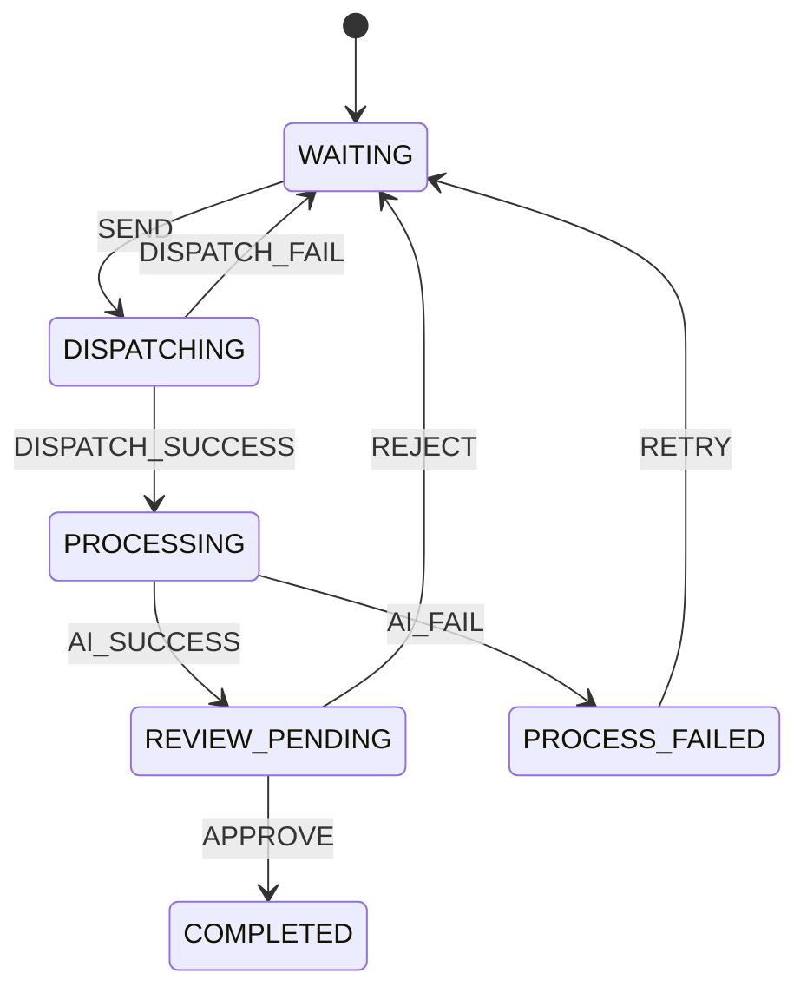

# 题目状态流转图

## 1. 题目主状态

题目主状态只表达业务可见进度：

1. `WAITING`
2. `DISPATCHING`
3. `PROCESSING`
4. `REVIEW_PENDING`
5. `COMPLETED`
6. `PROCESS_FAILED`

对应主链路：

`WAITING -> DISPATCHING -> PROCESSING -> REVIEW_PENDING -> COMPLETED`

失败与回退链路：

`DISPATCHING -> WAITING`

`PROCESSING -> PROCESS_FAILED -> WAITING`

`REVIEW_PENDING -> WAITING`

---

## 2. 题目状态机图（Mermaid）

---

## 3. 过程侧状态

### 3.1 task 状态

`question_process_task` 是异步链路的真实身份：

1. `PENDING_DISPATCH`
2. `DISPATCHED`
3. `SUCCEEDED`
4. `FAILED`

可选中间态还预留了：

5. `CALLBACK_RECEIVED`

### 3.2 outbox 状态

`question_outbox_event` 只关心派发本身：

1. `NEW`
2. `SENT`
3. `RETRYABLE`

### 3.3 inbox 状态

`question_callback_inbox` 只关心回包幂等：

1. `RECEIVED`
2. `PROCESSED`
3. `FAILED`

当前实现里：

- 首次回包先写 `RECEIVED`
- 处理完成后改成 `PROCESSED`
- 若已是 `PROCESSED`，说明是重复回包，直接忽略

---

## 4. 当前落地规则

1. `SEND` 只允许从 `WAITING` 发起。
2. `GENERATE` 只发无答案题，`VALIDATE` 只发有答案题。
3. 题目进入 `DISPATCHING` 后，会先写 task + outbox，再尝试实际发 MQ。
4. AI 回包先看 `callbackKey` 和 `taskId`，不再只依赖 `question.process_status == PROCESSING`。
5. `VALIDATE` 成功回包不改原答案，只新增带 `taskId` 的校验记录，等待人工审核。
6. `GENERATE` 和 `VALIDATE` 都会把题目推进到 `REVIEW_PENDING`，但审核决策语义不同。

---

## 5. 状态含义（简版）

1. `WAITING`：题目还没进入本次 AI 流程。
2. `DISPATCHING`：本地已承认“要发”，但还没确认已经成功派发。
3. `PROCESSING`：题目已成功进入 AI 处理链路。
4. `REVIEW_PENDING`：AI 已产出结果，等待人工裁决。
5. `COMPLETED`：本次流程闭环完成。
6. `PROCESS_FAILED`：本次处理失败，可重试。
